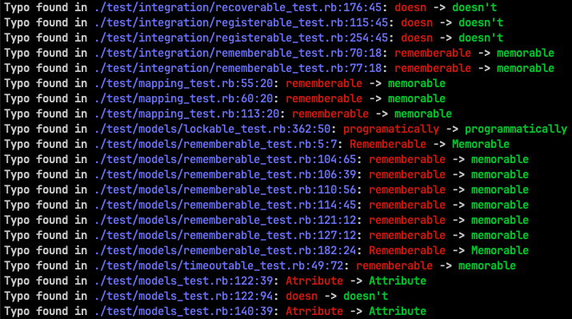

# TypoChecker

TypoChecker is a tool for scanning source code files for common typographical errors. The tool checks through text-based files in a given repository to identify and suggest corrections for any matches found.

<p align="center" width="100%">
    
</p>

## Features

- **Automatic typo detection**: Scan through files in a repository for known typos.
- **Support for multiple file types**: It checks various source code and text file extensions.
- **Colorized output**: Provides color-coded feedback for easier identification of typos.

## Installation

To install the TypoChecker gem, you can install it directly using `gem install`.

Run the following command in your terminal to install the gem globally:

```bash
gem install typo_checker
```

## Usage

Once installed, you can use TypoChecker in your Ruby project to scan a directory (or the current directory by default) for typos.

```bash
# typo_checker scan /path/repo
typo_checker scan . # current repo
```

### Output
When a typo is found, the tool prints out the following information in a colorized format:

- File path and line number in light blue.
- Incorrect word in red.
- Suggested correction in green.

Example output:

```bash
Typo found in /path/to/file.rb:10:15: myFuncton() -> myFunction()
```

## File Types Supported

TypoChecker supports the following file types by default:
- .rb (Ruby)
- .txt (Text)
- .md (Markdown)
- .html (HTML)
- .css (CSS)
- .js (JavaScript)
- .py (Python)
- .java (Java)
- .php (PHP)
- .go (Go)
- .swift (Swift)
- .ts (TypeScript)
- .scala (Scala)
- .c (C)
- .cpp (C++)
- .csharp (C#)
- .h (C Header)
- .lua (Lua)
- .pl (Perl)
- .rs (Rust)
- .kt (Kotlin)
- .sh, .bash, .bat (Shell Scripts)
- .json (JSON)
- .yaml (YAML)
- .xml (XML)
- .scss (Sass/SCSS)
- .tsv (Tab-separated values)
- .ps1 (PowerShell)
- .clj (Clojure)
- .elixir (Elixir)
- .f# (F#)
- .vhdl, .verilog (Hardware description languages)
- .ada (Ada)
- .ml (OCaml)
- .lisp (Lisp)
- .prolog (Prolog)
- .tcl (Tcl)
- .rexx (Rexx)
- .awk (AWK)
- .sed (Sed)
- .coffee (CoffeeScript)
- .groovy (Groovy)
- .dart (Dart)
- .haxe (Haxe)
- .zig (Zig)
- .nim (Nim)
- .crystal (Crystal)
- .reason (Reason)
- .ocaml (OCaml)
- .forth (Forth)
- .v (V)
- .xhtml (XHTML)
- .julia (Julia)
- .racket (Racket)
- .scheme (Scheme)
- .rust (Rust)
- .graphql (GraphQL)

## Contributing

We welcome contributions to this project! To contribute:

1. Fork the repository.
2. Create a new feature branch (git checkout -b your-feature).
3. Commit your changes (git commit -am 'Add some feature').
4. Push the changes to your fork (git push origin your-feature).
5. Open a pull request.

## Contributors

- Tran Dang Duc Dat ([datpmt](https://github.com/datpmt))

## License
The gem is available as open source under the terms of the [MIT License](LICENSE).